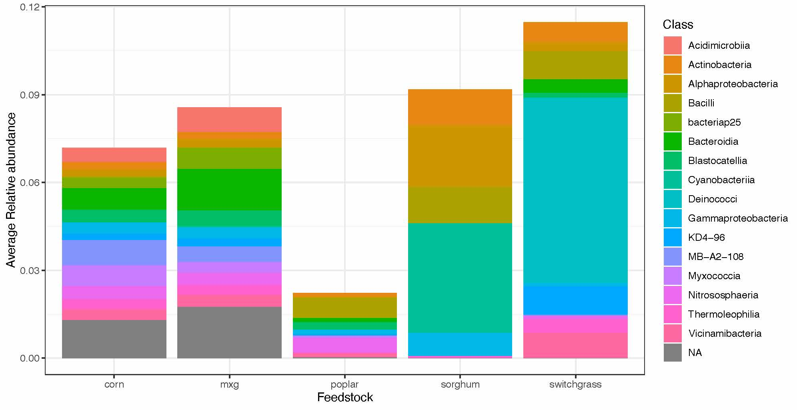
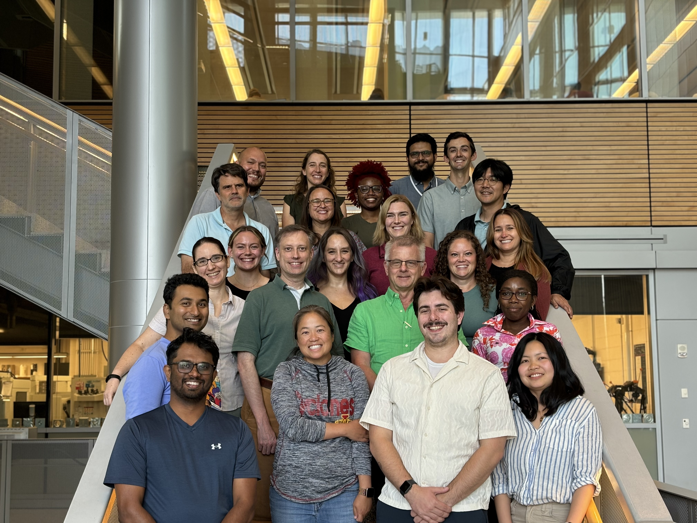

# Summary of workshop

## Overall summary

The workshop was very impactful and benefited from the engagement of representives across the BRCs (from early career to PIs). We all came together to discuss and quantify the "core" microbiome betweeen BRC feedstocks.  This output was successfully accomplished. This conversation, however, ended up being initially what brought us together and the beginning of more fruitful conversations and a momentum that is not readily achieved but with trust, passion, and friendships.

## Detailed Activities 
We began the workshop by identifying what the critical needs that would be served by inter-BRC collaborations would be.  Individuals were asked to contribute ideas, and then we grouped them together to identify main themes [photos](https://github.com/germs-lab/brc-data/tree/main/workshop_discussions/brainstorm_wishlist). Some themes that workshop participants thought were important for the inter-BRC efforts to consider:

* Linking function to our questions
* Carbon sequestration dedicated research efforts
* Characterization Core
* Sharing methods, databases, standards
* Growing Isolates Resources
* Characterzing Complex Interactions

We had four research talks from each BRC.  Many workshop participants noted that this was their favorite part of the workshop because of the time to discuss ongoing research.  All four talks were amazing.

In the afternoon, we hosted a tutorial to walk all participants, regardless of programming background, on how to implement criteria for defining a core on a small 16S rRNA sequencing dataset representing data across all four BRCs.  The workshop was effective for all participants. [Preworkshop Survey Results](./pre.pdf) and [Postworkshop Survey Results](./post.pdf)

The next day, we discussed the results of the tutorial and the identified [core](https://github.com/germs-lab/brc-data/tree/main/workshop_discussions/core_definition_brainstorm) and potential next steps.  The team had enthusiasm for a collaborative paper discussing the core microbiome of BRC crops including:

* History of core definitions
* Applications of how the core has helped us understand microbial interactions
* Case studies from BRCs of defining a core and its impact (Fertilization impacts, drought impacts, and within and across site diversity)

Two teams were created, one to synthesize literature and concepts and one to perform the analysis on BRC datasets. 

Overall, it was a terrific experience, and a lot of momentum was built to move this SRO forward into spaces that can fill the knowledge gaps of how microbes can help us grow our feedstocks.

## Participants
Adina Howe, CABBI

Alyssa Carrell, CBI

Andie Suratt, CABBI

Brandon Kristy, GLBRC

Clarisse Siababa, CABBI

Dana Carper, CBI

Grace Carey, CABBI

Henrik Scheller, JBEI

Imani Pascoe, GLBRC

Jae Lee, CABBI

Janith Chandrasoma, CABBI

Lillian Chiang, CABBI

Lorien Radmer, CABBI

Melissa Cregger, CBI

Najmuj Sakib, CABBI

Ndenum Suzzy Shitta, CBI

Nicole Geerdes, CABBI

Patrick Suthers, CABBI, CBI

Phillip de Lorimier, CABBI

Puja Bajracharya, CABBI

Rounak Patra, CABBI

Sarah Lebeis, GLBRC

Stan Martin, CBI

Tomas Rush, CBI

Valentina Infante, GLBRC

Yen Ning Chai, JBEI

